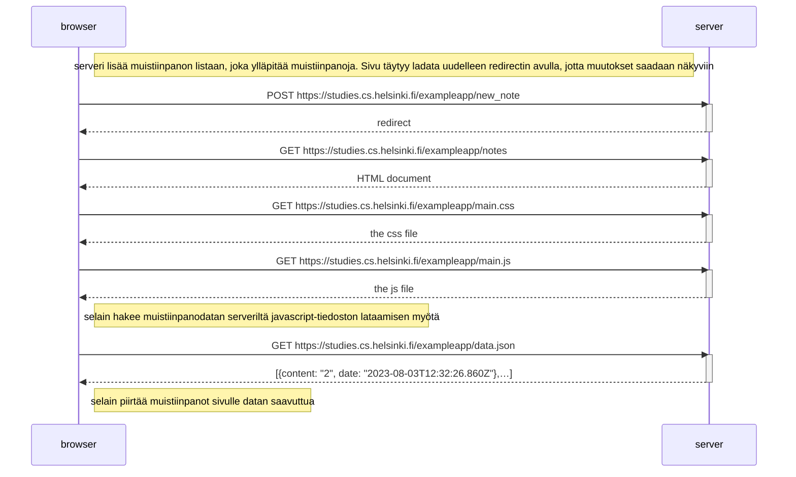

```mermaid
sequenceDiagram
    participant browser
    participant server

    note left of server: serveri lisää muistiinpanon listaan, joka ylläpitää muistiinpanoja. Sivu täytyy ladata uudelleen redirectin avulla, jotta muutokset saadaan näkyviin
    browser->>server:POST https://studies.cs.helsinki.fi/exampleapp/new_note
    activate server
    server-->>browser: redirect
    deactivate server

    browser->>server:GET https://studies.cs.helsinki.fi/exampleapp/notes
    activate server
    server-->>browser: HTML document
    deactivate server

    browser->>server:GET https://studies.cs.helsinki.fi/exampleapp/main.css
    activate server
    server-->>browser: the css file
    deactivate server

    browser->>server: GET https://studies.cs.helsinki.fi/exampleapp/main.js
    activate server
    server-->>browser: the js file
    deactivate server

    note right of browser: selain hakee muistiinpanodatan serveriltä javascript-tiedoston lataamisen myötä
    browser->>server: GET https://studies.cs.helsinki.fi/exampleapp/data.json
    activate server
    server-->>browser: [{content: "2", date: "2023-08-03T12:32:26.860Z"},…]
    deactivate server
    note right of browser: selain piirtää muistiinpanot sivulle datan saavuttua

```
