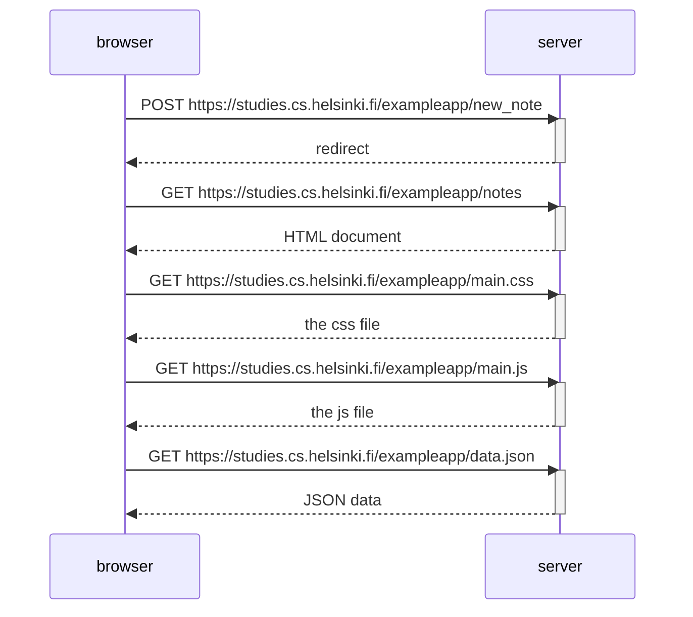

```mermaid
sequenceDiagram
    participant browser
    participant server

    browser->>server:POST https://studies.cs.helsinki.fi/exampleapp/new_note
    %%serveri lisää muistiinpanon listaan, joka ylläpitää muistiinpanoja. Sivu täytyy ladata uudelleen redirectin avulla, jotta muutokset saadaan näkyviin
    activate server
    server-->>browser: redirect
    deactivate server

    browser->>server:GET https://studies.cs.helsinki.fi/exampleapp/notes
    activate server
    server-->>browser: HTML document
    deactivate server

    browser->>server:GET https://studies.cs.helsinki.fi/exampleapp/main.css
    activate server
    server-->>browser: the css file
    deactivate server

    browser->>server: GET https://studies.cs.helsinki.fi/exampleapp/main.js
    activate server
    %%selain hakee javascript-tiedoston, joka sisältää koodin muistiipanojen hakemiseen serveriltä sekä niiden piirtämiseen selaimessa.
    server-->>browser: the js file
    deactivate server

    browser->>server: GET https://studies.cs.helsinki.fi/exampleapp/data.json
    activate server
    %&serveri palauttaa dataa kaikista muistiinpanoista JSON-muodossa. Serverin täytyi ladata sivu uudelleen, sillä ohjelma hakee datan ainoastaan sivun lataamisen yhteydessä
    server-->>browser: JSON data
    deactivate server 

```
